# LobStars — Платформа для Дизайнеров и Музыкантов

Музыкальный плеер, где дизайнеры продают скины оформления, музыканты прикрепляют их к трекам для промо, а слушатели поддерживают авторов виртуальными звёздами.

## Что нового
*(полный текст — в [docs/WHATS_NEW.md](docs/WHATS_NEW.md))*

### Основная идея

LobStars — музыкальный плеер, в котором слушатель сам управляет тем, как выглядит его плеер. Тема оформления (скин) меняет не одну картинку, а всё приложение сразу: свой баннер на каждом из четырёх главных окон (главная, поиск, Your Library, окно выбранной мелодии), а также цвет и форму кнопки «играть» в плеере. Любую тему, кроме «Стандартного», можно сделать своей, загрузив собственные фотографии. А карточки мелодий аккуратно подстраиваются под ширину окна, ничего не обрезая.

В более широком плане LobStars — площадка для дизайнеров оформления и музыкантов: дизайнеры делают темы, музыканты загружают треки, а слушатели поддерживают понравившееся игровыми звёздами (подробнее — в плане проекта, раздел «позже»).

### Новые возможности

#### Темы с четырьмя баннерами — «в прототипе»
- У каждой темы четыре разных баннера: для главной, поиска, Your Library и окна выбранной мелодии.
- Тема применяется одним нажатием на странице «Скины» (ссылка в меню слева) и сразу меняет баннеры всех четырёх окон и кнопку «играть» в плеере.
- Стандартные баннеры тем остаются как есть: свои фото хранятся отдельно и их не затирают.
- «Стандартный» — исходный вид приложения с прежними баннерами; его не редактируют.

#### «Редактировать» и «Вернуть как было» — «в прототипе»
- Во всех темах, кроме «Стандартного», есть кнопка «Редактировать».
- В ней четыре места для фото: Главная, Поиск, Your Library, Окно мелодии. Не больше четырёх фото на тему — по одному на окно.
- Любое из четырёх фото можно заменить своим: JPG, PNG или WebP до 10 МБ. Фото автоматически обрезается по центру до 1200×400. Во время загрузки видны полоса и процент, ошибки пишутся по-русски.
- Кнопка «Вернуть как было» есть у каждого окна отдельно: она возвращает стандартную картинку темы только в этом окне.
- Изменения сохраняются только для своего аккаунта и, если тема активна, сразу видны на всех страницах. Гости видят на карточке «Войдите, чтобы редактировать».

#### Адаптивные карточки мелодий — «в прототипе» (pull request #5)
- Карточки мелодий и альбомов больше не обрезаются: сетка сама подбирает число колонок под ширину окна.
- Проверено на ширинах 1024, 1280, 1366, 1600 и 1920 пикселей на страницах Home, Search, Your Library, альбома и «Скины», с открытой правой панелью исполнителя и без неё. Обрезанных карточек нет; колонок 3, 5, 5, 6 и 8 соответственно.

Скриншоты и описание каждой темы — в [docs/THEMES.md](docs/THEMES.md).


---

## 1. Механика скинов
**Статус: в прототипе**

**Страница скинов** показывает встроенные тематические скины с уникальными баннерами:

**В прототипе:**
- **Стандартный** (default) — чистый нейтральный дизайн без тематического оформления. Активен по умолчанию для новых пользователей. Всегда бесплатен, первый в списке. Одним тапом сбрасывает любое тематическое оформление.
- **Классический Spotify** — тёмная тема, зелёные акценты (#1DB954). Музыка: pop, rock, indie, electronic.
- **Неоновая Ночь** — киберпанк с неоновыми контурами (#00FFFF, #FF00FF). Музыка: electronic, synthwave, cyberpunk, techno.
- **Космос** — фиолетовые звёздные оттенки (#8B5CF6). Музыка: ambient, electronic, space, soundtrack.
- **Закат** — тёплые оранжево-розовые тона (#FF6B6B, #FFB347). Музыка: chillout, lounge, downtempo, acoustic.
- **Ретро Волны** — синтвейв стиль (#FF6EC7, #7B2CBF). Музыка: synthwave, electronic, retro, 80s.
- **Минимализм** — монохромный дизайн off-white (#F5F5F5). Музыка: ambient, minimal, piano, classical.
- **Броня гения** — красно-золотой tech HUD (#C41E3A, #FFD700). Музыка: rock, electronic, metal, industrial.
- **Ночной паутинщик** — десатурированный красно-синий городской пейзаж (#8B0000, #4682B4). Музыка: rock, electronic, alternative, indie.
- **Бейкер-стрит** — викторианский детектив с янтарным акцентом (#FFBF00, #8B4513). Музыка: classical, jazz, acoustic, instrumental.
- **Викинги** — северные фьорды и драккары (#4682B4, #708090). Музыка: folk, epic, ambient, soundtrack.
- **Железный трон** — средневековый замок (#2C2C2C, #8B0000). Музыка: orchestral, cinematic, epic, soundtrack.
- **Звёздный флот** — исследование далёких галактик (#4169E1, #1E90FF). Музыка: electronic, space, ambient, soundtrack.
- **Менталист** — тёплый минимализм с чайным настроением (#D4A76A, #8B7355). Музыка: jazz, acoustic, instrumental, ambient.
- **Косплей** — яркие цвета аниме-конвенций (#FF1493, #00CED1). Музыка: anime, jpop, electronic, dance.

*(Все темы используют оригинальное или сгенерированное оформление без официальных логотипов, кадров из фильмов, товарных знаков или изображений актёров)*
*(устарело: сейчас баннеры 14 тематических скинов — фотографии, источники и лицензии которых (Unsplash License, NASA) перечислены в [frontend/public/skins/ATTRIBUTION.md](frontend/public/skins/ATTRIBUTION.md); «Стандартный» использует исходные заголовки приложения. На баннерах «Минимализм» (логотип на пиле) и «Косплей» (вывески магазинов) видны логотипы)*

**Скриншоты:**

<details>
<summary>Страница скинов (Mobile & Desktop)</summary>


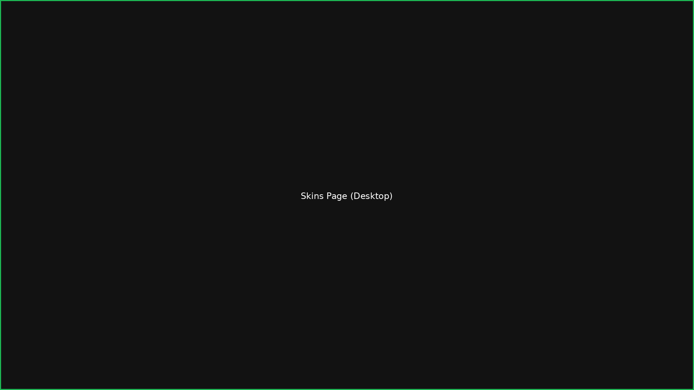
</details>

<details>
<summary>Стандартный скин (Home & Player)</summary>


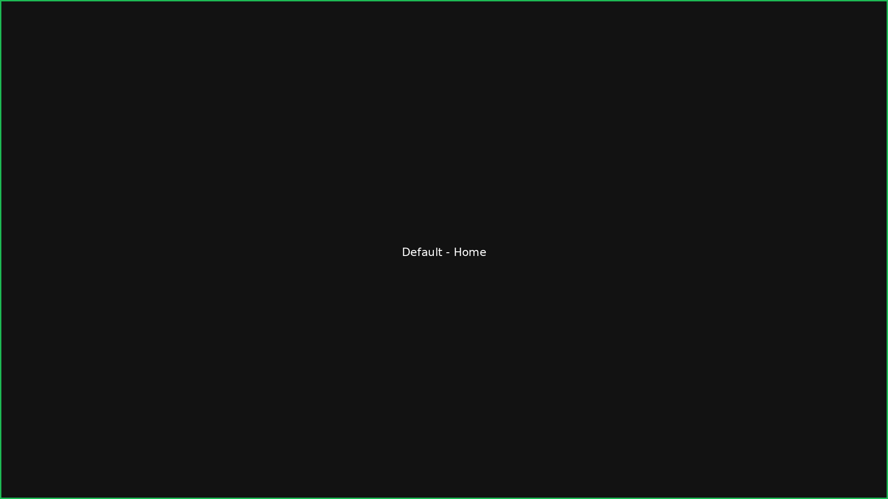

</details>

<details>
<summary>Викинги и Железный трон</summary>


</details>

<details>
<summary>Загрузка фото и Jamendo рекомендации</summary>


</details>

*(устарело: файлы `docs/screenshots/*.png` выше — заглушки с подписью, а не снимки приложения; настоящие скриншоты — в разделе «Темы оформления» ниже и в [docs/THEMES.md](docs/THEMES.md))*

**Загрузка своего фото:**
Пользователь загружает изображение → сервер автоматически:
- Исправляет EXIF-ориентацию (фото с телефона)
- Создаёт баннер (1200×400), фон (800×800), миниатюру (300×200) через center-crop
- Конвертирует в WebP с оптимизацией
- Извлекает доминантный и вторичный цвет для акцентов кнопок
- Сохраняет как новый скин с автоматическим рестайлингом

*(устарело: сейчас кнопка «Создать свой скин» создаёт новый личный скин из 1–4 фото — каждое обрезается до 1200×400 WebP с исправлением EXIF, акцентные цвета берутся из первого фото; а в любую тему, кроме «Стандартного», можно поставить свои фото через «Редактировать» — см. «Темы оформления» ниже)*

**Применение:** выбрали скин → он мгновенно применяется **на всех экранах** без перезагрузки:
- Главная (home) — баннер в хедере
- Библиотека (library) — фон карточек
- Плеер (now-playing) — полноэкранный фон с оверлеем
- Мини-плеер (player bar) — акцентные цвета кнопок
- Страница скинов — превью в карточках
- Профиль — аватар и фон

*(устарело: сейчас проверено, что тема меняет баннер в шапке четырёх окон — Главная, Поиск, Your Library, окно альбома/мелодии — и цвет/форму кнопки «играть» в нижнем плеере; фон карточек библиотеки, полноэкранный фон плеера и фон профиля в этой версии не проверены)*

**Стили кнопок:** 5 вариантов (круглые, квадратные, таблетки, контуры, минимализм)  
**Анимации no-buttons mode:** эквалайзер, волны, частицы, градиентные блобы (одним тапом скрываются все контролы, остаётся только анимация под музыку; respects `prefers-reduced-motion`)

**Jamendo интеграция (в прототипе):** музыкальный каталог с ротацией треков и тематическими рекомендациями. Каждый визит/refresh показывает разные треки вместо одних и тех же. Блок **«Новое для вас»** — непоказанные треки, **«Уже слушали»** — ранее показанные с маркером. Отслеживание через DB (авторизованные) или localStorage (гости). Кнопка **«Показать другие»** для принудительной ротации. **Рекомендации соответствуют активному скину**: каждый скин связан с определёнными жанрами/настроением (Vikings → folk/epic/ambient, Thrones → orchestral/cinematic/medieval, default → общая ротация). При смене скина блок рекомендаций обновляется. Fallback на более широкие теги если основные дают мало треков. Варьирующиеся офсеты, микс популярных/новых треков, респект к Jamendo API лимитам через кеширование.


### Темы оформления
**Статус: в прототипе**

Все 16 скриншотов лежат в `docs/screenshots/themes/`, подробные описания — в [docs/THEMES.md](docs/THEMES.md). Темы сняты на странице **Home** при ширине окна 1366 px со стандартными баннерами, под тестовым пользователем. Расположение элементов на всех скриншотах тем одинаковое:
- **слева** — меню: Home, Search, Your Library, «Скины»; под ним список альбомов;
- **сверху** — баннер страницы («Good morning»). У каждой темы 4 разных баннера, по одному на Главную, Поиск, Your Library и окно мелодии; на скриншоте — баннер Главной. Справа вверху «Admin» и профиль, у правого края панель «Исполнитель»;
- **под баннером** — сетка карточек треков. Она подстраивается под ширину окна (PR #5): проверено на 1024, 1280, 1366, 1600 и 1920 px с открытой панелью исполнителя и без неё, карточки не обрезаются;
- **внизу** — плеер. Кнопка «играть» окрашена в акцентный цвет темы и имеет форму по стилю кнопок темы.

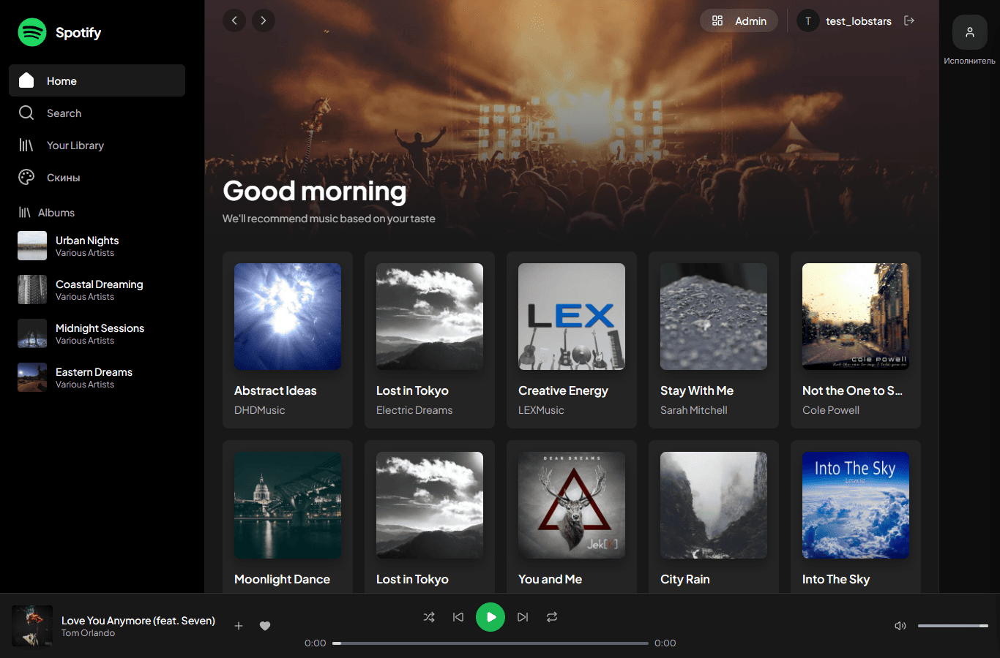
**Классический Spotify** — баннер — концертный зал, толпа перед сценой в свете прожекторов; кнопка «играть» — зелёный круг.


**Неоновая Ночь** — баннер — розово-красный цветок на синем фоне; кнопка «играть» — бирюзовый контур.

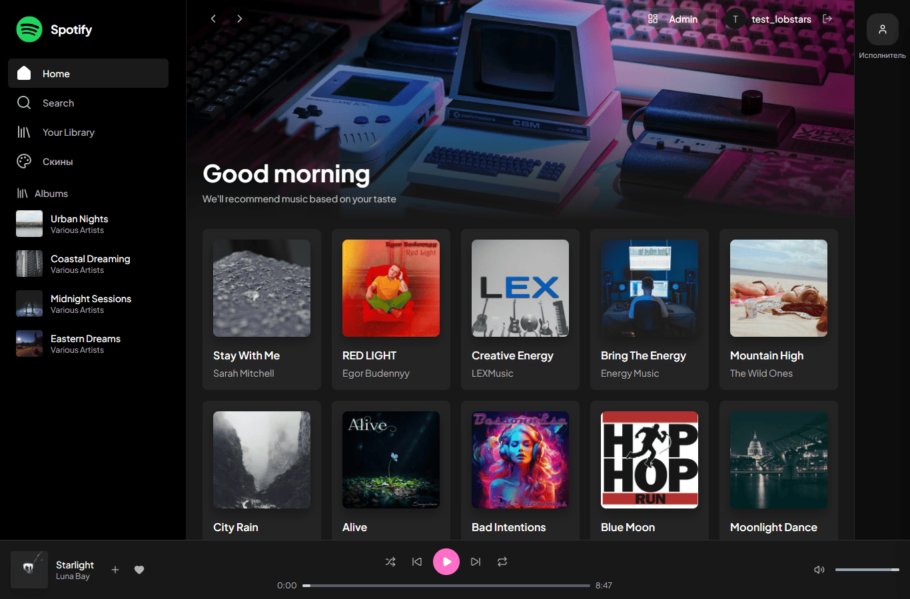
**Ретро Волны** — баннер — ретро-компьютер и игровая приставка в розово-фиолетовом свете; кнопка «играть» — розовый круг.

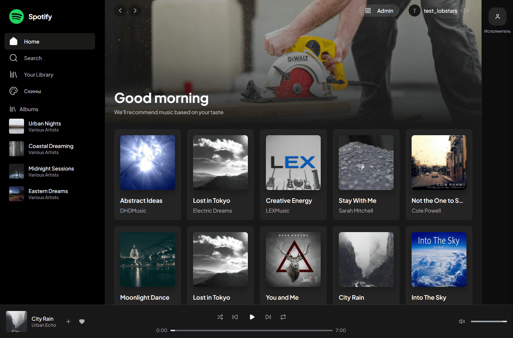
**Минимализм** — баннер — руки с циркулярной пилой; кнопка «играть» — белый значок без фона.


**Космос** — баннер — розово-фиолетовая туманность на звёздном небе; кнопка «играть» — фиолетовый круг.

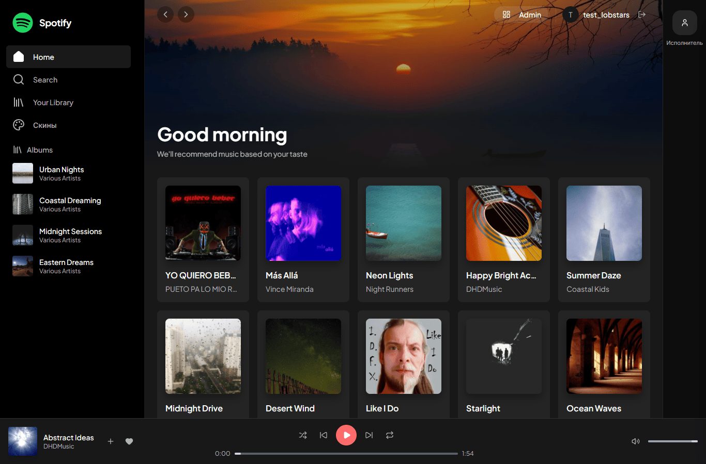
**Закат** — баннер — солнце садится над водой, по краям силуэты деревьев; кнопка «играть» — коралловый круг.

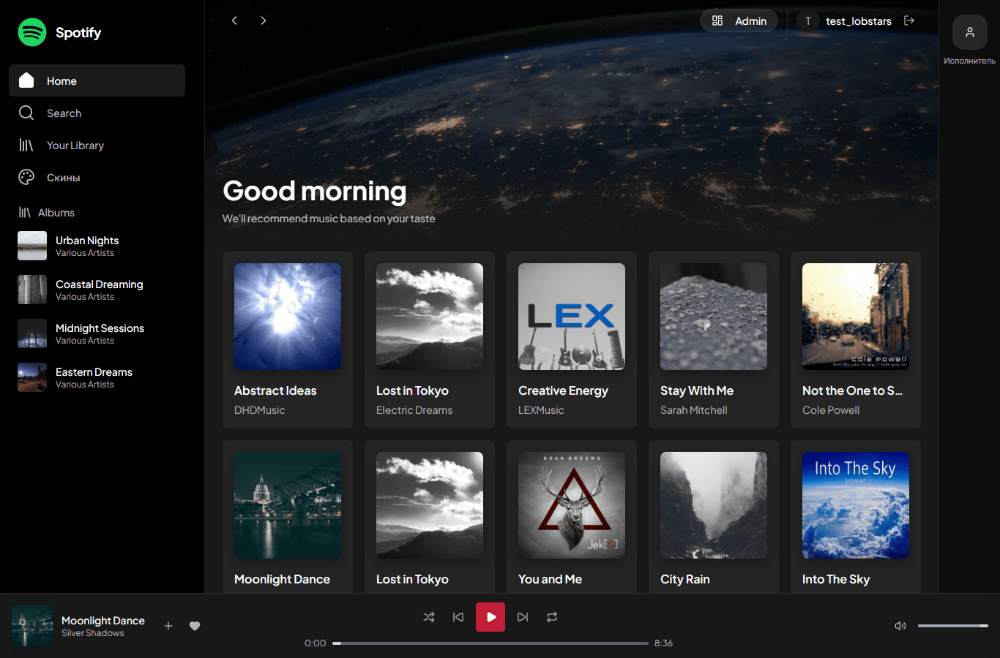
**Броня гения** — баннер — ночная Земля из космоса с огнями городов; кнопка «играть» — красный квадрат.

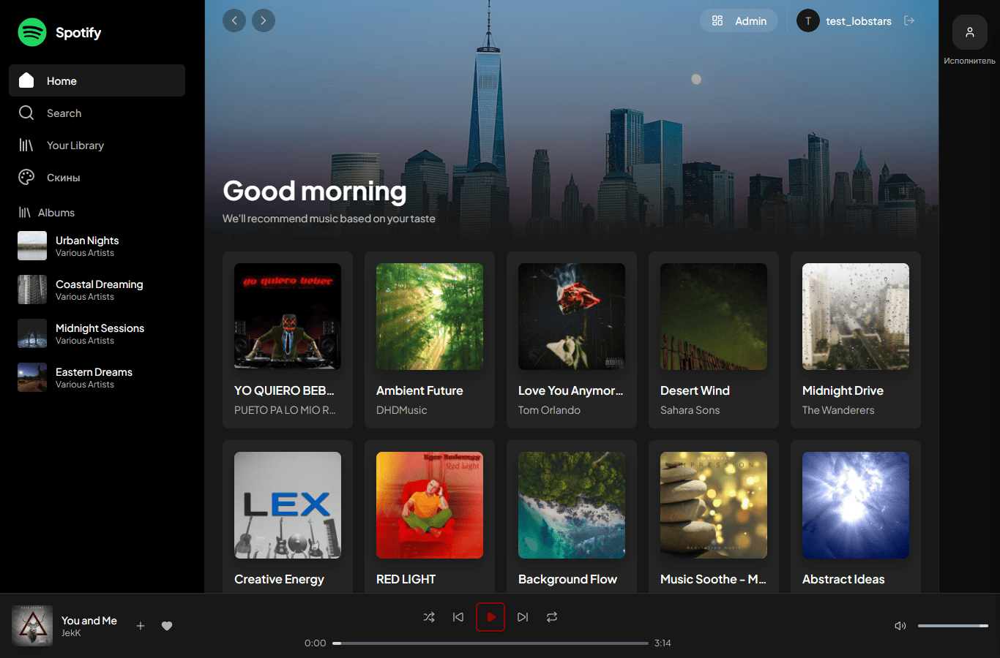
**Ночной паутинщик** — баннер — небоскрёбы большого города в сумерках; кнопка «играть» — тёмно-красный контур (малозаметен).


**Бейкер-стрит** — баннер — панорама города с изогнутой рекой, вид сверху; кнопка «играть» — янтарный круг.


**Викинги** — баннер — северное сияние над горами; кнопка «играть» — стально-синий квадрат.

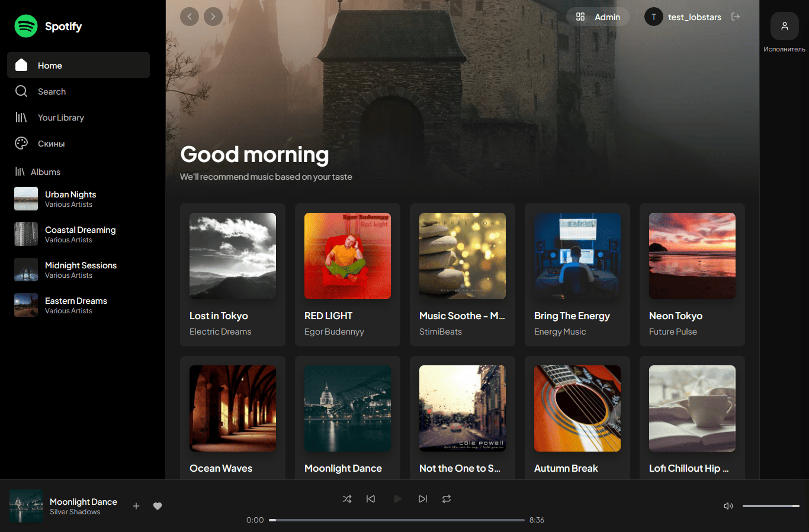
**Железный трон** — баннер — каменная башня с воротами в тумане; кнопка «играть» — почти чёрный значок без фона (почти не виден).

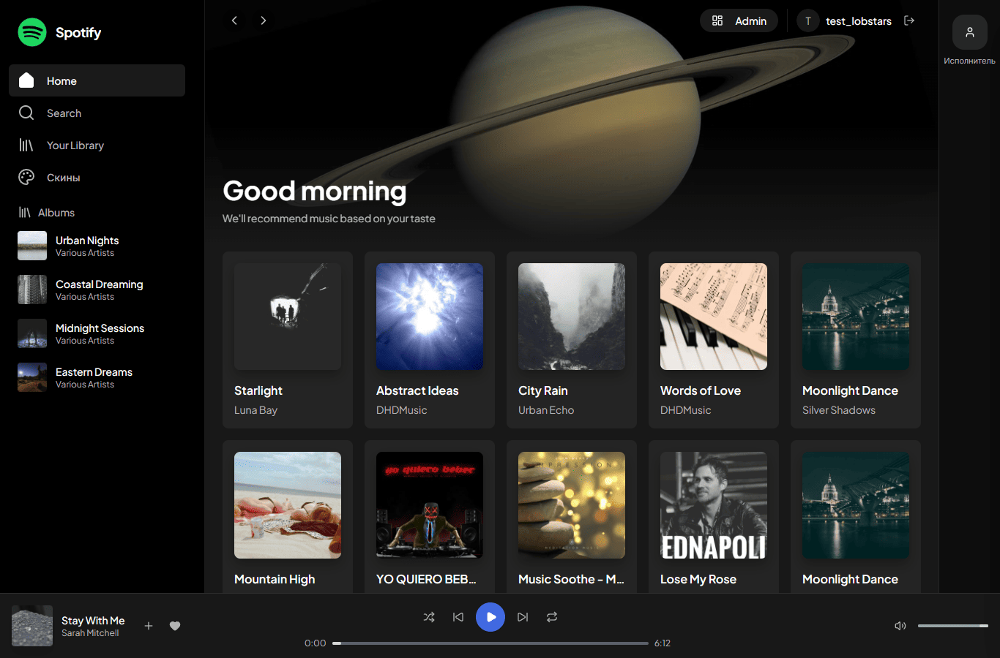
**Звёздный флот** — баннер — Сатурн с кольцами на чёрном фоне; кнопка «играть» — синий круг.

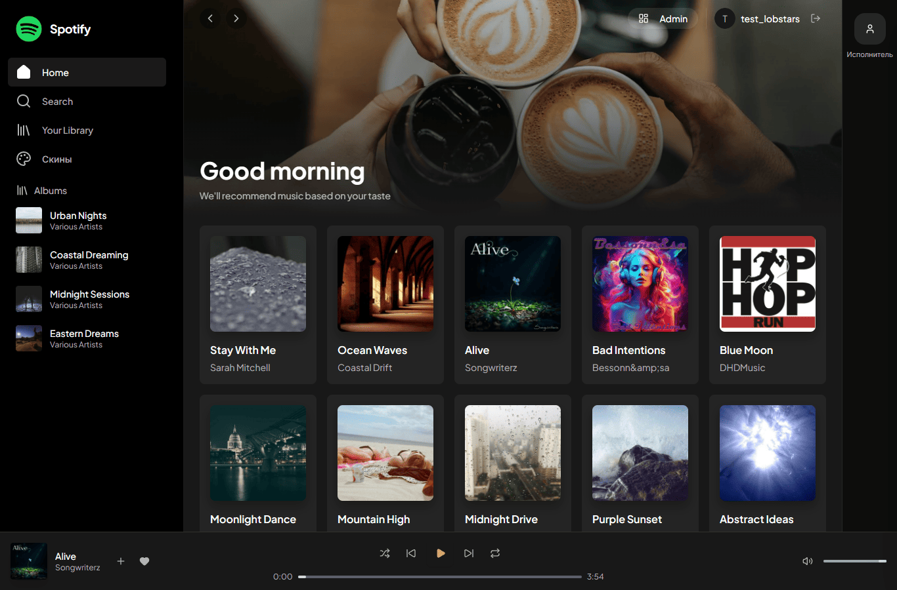
**Менталист** — баннер — руки с чашками кофе с латте-артом; кнопка «играть» — бежево-золотой значок без фона.

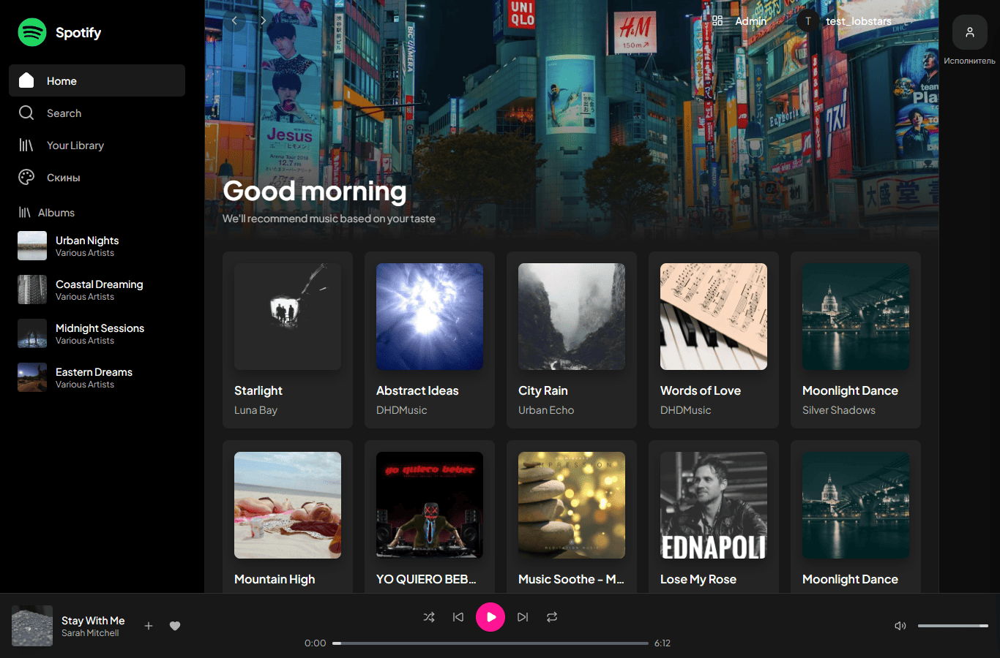
**Косплей** — баннер — ночная улица большого города с яркими вывесками; кнопка «играть» — ярко-розовый круг.


**Панель «Редактировать»** (страница «Скины», тема «Викинги»). На панели 4 окна: Главная, Поиск, Your Library, Окно мелодии. У каждого окна есть превью, метка «Своё фото»/«Картинка темы» и кнопки «Загрузить своё фото» и «Вернуть как было». Кнопка «Редактировать» есть у всех тем, кроме «Стандартного».


**Свои фото в теме «Викинги»** — сверху на Главной вместо стандартного баннера загруженное фото с надписью «Главная». Остальное оформление темы не меняется.

---

## 2. Библиотека скинов
**Статус: в прототипе**

**Моя библиотека** — личная коллекция скинов пользователя:
- Встроенные скины (доступны всем бесплатно)
- Купленные скины других дизайнеров (за виртуальные звёзды)
- Собственные скины из загруженных фото

Дизайнер устанавливает **цену в звёздах** при публикации скина. Покупка создаёт entitlement-запись, скин добавляется в библиотеку покупателя. Поддержка артиста (support) тоже даёт доступ к скину.

---

## 3. Стартовое предложение для новых пользователей
**Статус: позже**

При первом входе показывается **один свежий или растущий скин**, предпросмотр на одном треке:
> «Вы можете быть первым, кто проспонсирует появление этого скина у других пользователей»

Аналогично для **трека**: показывается недавно загруженный или набирающий популярность трек с той же идеей — будь первым спонсором.

Блок dismissible, показывается один раз.

---

## 4. Треки: загрузка, ставка и звёздная поддержка
**Статус: в прототипе (загрузка), позже (тотализатор)**

**Загрузка трека:**
Музыкант загружает MP3 (до 20 МБ) и **делает ставку в виртуальных звёздах** на свой трек. Если трек **«выстреливает»** (набирает N поддержек или прослушиваний — порог задаётся в коде), он попадает в рекомендации.

**Поддержка слушателей:**
Слушатель видит понравившийся трек и может поддержать его, выбрав **1, 2 или 5 звёзд**. Эта поддержка считается инвестицией в трек.

**Выплаты спонсорам (формула):**
- Трек **«выстрелил»** (hit): возврат ставки + 50% бонус
- Трек **«выгорел»** (burned, не набрал порог за 30 дней): возврат 20% ставки
- Активный статус (pending): ставка заморожена

Пример: спонсор поставил 5 звёзд. Трек «выстрелил» → получает 7.5 звёзд. Трек «выгорел» → получает 1 звезду.

---

## 5. Тотализатор для скинов
**Статус: позже**

Дизайнер ставит звёзды при публикации скина. Слушатели поддерживают скин (1/2/5 звёзд). Правила выплат — те же, что для треков (п. 4).

---

## 6. Связка скин+трек с анимацией
**Статус: в прототипе (связка), позже (анимация на треке)**

Автор может **прикрепить один или несколько своих скинов к загруженному треку**. При воспроизведении этого трека показывается прикреплённый скин.

Если у скина включена анимация (например, пульсирующий эквалайзер), она воспроизводится в no-buttons mode плеера для этого трека. Если реализация анимации сложна — достаточно статичного скина на треке.

---

## 7. Самопродвижение для музыкантов и дизайнеров
**Статус: позже**

Любой пользователь может быть создателем и продвигать:
- **Себя как музыканта** (artist profile card)
- **Свои скины как дизайнер**
- **Свои загруженные треки** с прикреплёнными скинами

Продвижение: пользователь тратит звёзды на рекламный слот на ограниченное время (24 часа, 7 дней). Продвигаемые элементы появляются в полке **«Продвигается»** / **«Реклама»** на главной и в рекомендациях.

Единая модель: `promotion (owner_id, target_type, target_id, stars_spent, starts_at, ends_at)`.

**Onboarding/landing-блок:**
Платформа предлагает краткую презентацию для:
- Музыкантов: «Продвигайте себя, загружайте музыку»
- Дизайнеров: «Продавайте и продвигайте скины»
- Гибридов: «Создавайте скины, прикрепляйте к своим трекам»

---

## 8. Ставки слушателей на контент
**Статус: позже**

Обычный слушатель (не автор) может **поставить звёзды** на:
- Трек
- Скин
- Связку скин+трек (bundle)

Механика та же, что в п. 4: выбор 1/2/5 звёзд, те же правила выплат при «выстреле» или «выгорании».

---

## 9. Виртуальные звёзды (game currency)
**Статус: в прототипе**

**Важно:** все звёзды — это **игровая валюта, не реальные деньги**. Это demo-прототип.

- Каждый новый пользователь получает **100 звёзд** при регистрации
- Звёзды используются для покупки скинов, поддержки треков, ставок, продвижения
- Баланс хранится в `user_profiles.stars_balance` (Postgres для зарегистрированных, localStorage для гостей)

**Переход на реальные деньги:**
Реальные инвестиции, ставки и распределение прибыли возможны **только после консультации с юристом** по вопросам:
- Лицензирование музыки
- Авторские права на изображения
- Финансовое регулирование (ставки, азартные игры)
- Налогообложение
- KYC/AML процедуры

---

## 10. Отложенные возможности (Later)

Следующие функции **не реализованы** в текущем прототипе:

### Реальные платежи
Интеграция Stripe/PayPal/ЮKassa, вывод средств, реальные денежные транзакции.

### Чат для сделок
Личные сообщения, переговоры о кастомных скинах, обсуждение коллабораций.

### Платное продвижение скинов
Таргетированная реклама, продвижение профилей музыкантов, аналитика эффективности.

### Импорт изображений
Pinterest/Instagram импорт, синхронизация с Apple Music/Spotify, экспорт скинов в шаблоны.

### Расширенные функции
Видео-фоны, 3D-анимации, VR/AR режимы, second-screen/cast, модерация контента, защита от накрутки.

---

## Как запустить

### Требования
- Docker и Docker Compose
- Порты 5432, 8000, 3000 свободны

### Запуск
```bash
git clone <url>
cd <repo>

docker-compose up --build

# Frontend: http://localhost:3000
# Backend API: http://localhost:8000
# API Docs: http://localhost:8000/docs
```

### Тестирование с мобильного (локальная сеть)

Узнайте IP компьютера (`ipconfig` на Windows, `ifconfig` на macOS/Linux) и откройте на телефоне:
```
http://<IP>:3000
```
Загружайте фото с камеры, меняйте скины — всё работает touch-friendly.

---

## Технический стек

**Backend:** Python 3.11+, FastAPI, SQLAlchemy, PostgreSQL 16, Alembic, Pillow, JWT  
**Frontend:** React 19, TypeScript, Zustand, Tailwind CSS, Vite, Axios  
**Infrastructure:** Docker Compose, Nginx, WebSocket

---

## Структура проекта

```
.
├── app/                    # Backend (FastAPI)
│   ├── models/            # SQLAlchemy модели (Skin, Track, SkinEntitlement, etc.)
│   ├── routes/            # API endpoints (skins, songs, auth, player, etc.)
│   ├── image_processing.py # Pillow: resize, crop, EXIF fix, color extraction
│   └── main.py           # FastAPI app
├── alembic/              # Database migrations
├── frontend/             # React app
│   ├── src/
│   │   ├── components/   # UI (AudioPlayer, PlaybackControls, etc.)
│   │   ├── pages/        # Страницы (Home, Library, Skins, etc.)
│   │   ├── stores/       # Zustand (usePlayerStore, useSkinStore, etc.)
│   └── public/           # Static assets
├── media/                # Uploaded files (Docker volume)
│   ├── skins/           # Banner/background/thumbnail
│   │                    #   (сейчас также skins/user/<id>/ — свои фото пользователя в темах)
│   ├── songs/           # Audio files
│   └── images/          # Album covers
└── docker-compose.yml    # Container orchestration
```

---

## Лицензия

MIT License — используйте свободно, но на свой риск.

---

**⚠️ Disclaimer:**  
Это демо-прототип. Виртуальные звёзды — не реальная валюта. Перед запуском реальных платежей обязательно проконсультируйтесь с юристом.
