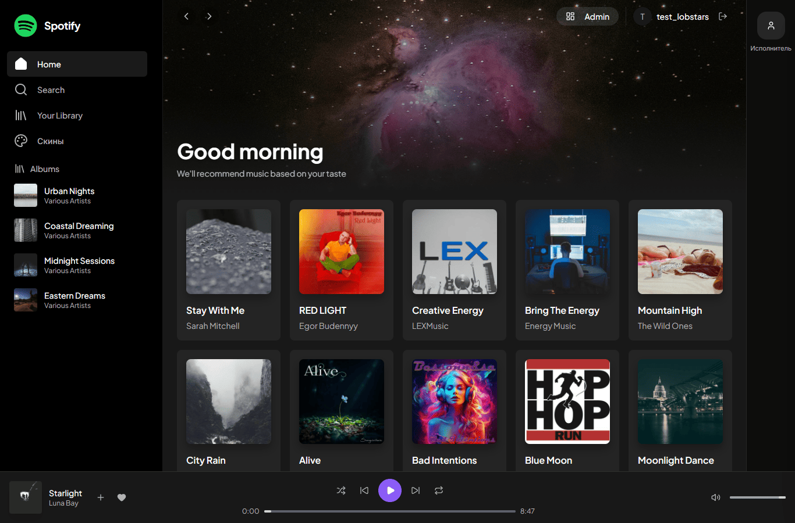
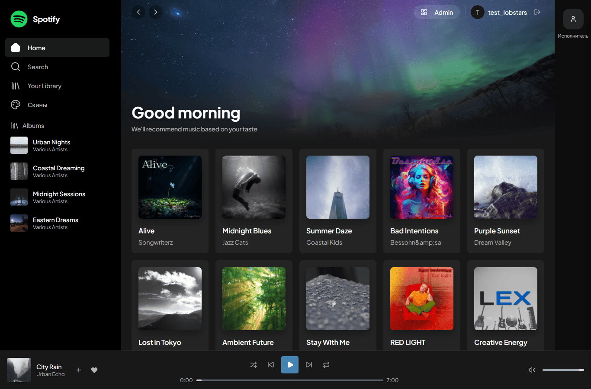
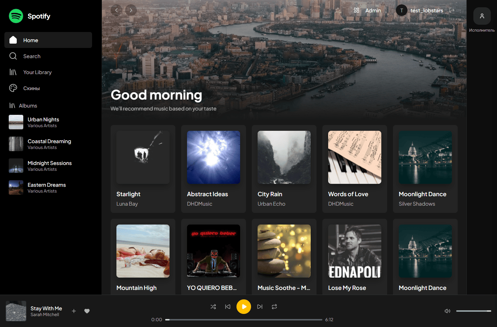
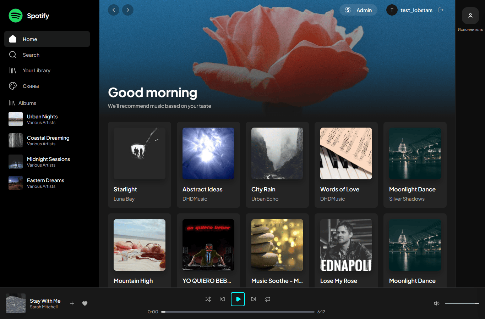
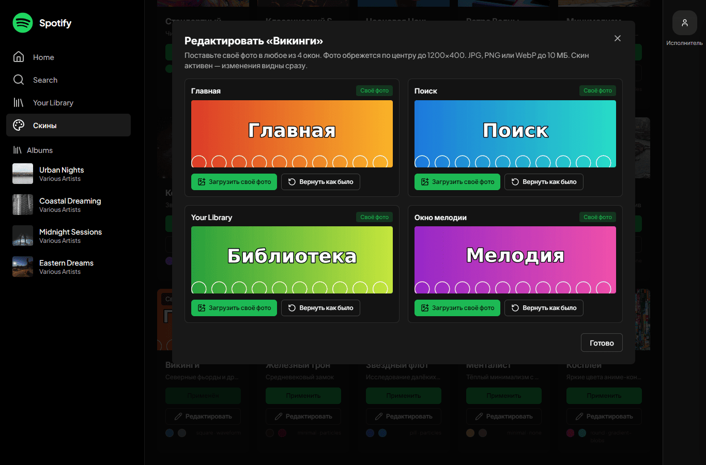
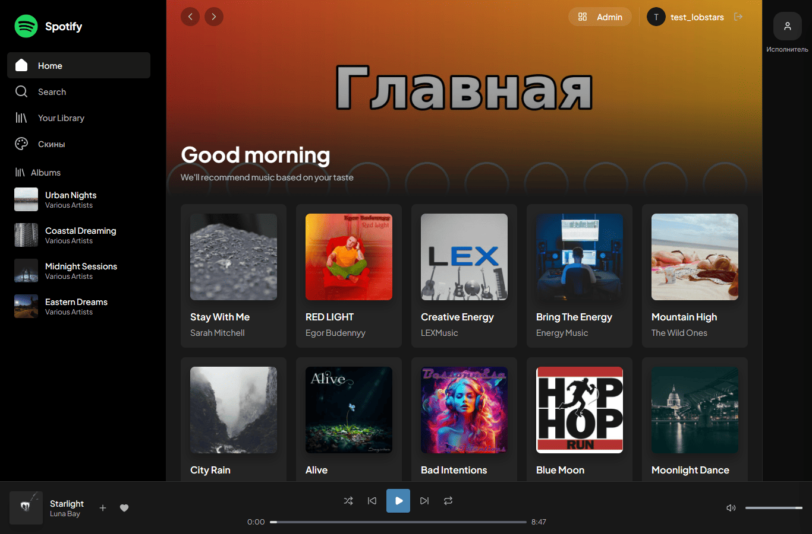

# LobStars — Платформа для Дизайнеров и Музыкантов

Музыкальный плеер, где дизайнеры продают скины оформления, музыканты прикрепляют их к трекам для промо, а слушатели поддерживают авторов виртуальными звёздами.

**Что нового** → [docs/WHATS_NEW.md](docs/WHATS_NEW.md) · **Все темы со скриншотами** → [docs/THEMES.md](docs/THEMES.md)

---

## 1. Механика скинов
**Статус: в прототипе**

**Тема (скин)** — это 4 баннера, по одному на окно: Главная, Поиск, Your Library и окно выбранной мелодии/альбома. Ещё тема задаёт акцентный цвет и стиль кнопки «играть» в нижнем плеере. Тему выбирают на странице «Скины» (пункт меню слева), применяется она одним нажатием и сразу видна на всех страницах.

**Встроенные темы (в прототипе):**
- **Стандартный** (default) — чистый нейтральный дизайн без тематического оформления. Активен по умолчанию для новых пользователей. Всегда бесплатен, первый в списке. Одним тапом сбрасывает любое тематическое оформление.
- **Классический Spotify** — тёмная тема, зелёные акценты (#1DB954). Музыка: pop, rock, indie, electronic.
- **Неоновая Ночь** — киберпанк с неоновыми контурами (#00FFFF, #FF00FF). Музыка: electronic, synthwave, cyberpunk, techno.
- **Космос** — фиолетовые звёздные оттенки (#8B5CF6). Музыка: ambient, electronic, space, soundtrack.
- **Закат** — тёплые оранжево-розовые тона (#FF6B6B, #FFB347). Музыка: chillout, lounge, downtempo, acoustic.
- **Ретро Волны** — синтвейв стиль (#FF6EC7, #7B2CBF). Музыка: synthwave, electronic, retro, 80s.
- **Минимализм** — монохромный дизайн off-white (#F5F5F5). Музыка: ambient, minimal, piano, classical.
- **Броня гения** — красно-золотой tech HUD (#C41E3A, #FFD700). Музыка: rock, electronic, metal, industrial.
- **Ночной паутинщик** — десатурированный красно-синий городской пейзаж (#8B0000, #4682B4). Музыка: rock, electronic, alternative, indie.
- **Бейкер-стрит** — викторианский детектив с янтарным акцентом (#FFBF00, #8B4513). Музыка: classical, jazz, acoustic, instrumental.
- **Викинги** — северные фьорды и драккары (#4682B4, #708090). Музыка: folk, epic, ambient, soundtrack.
- **Железный трон** — средневековый замок (#2C2C2C, #8B0000). Музыка: orchestral, cinematic, epic, soundtrack.
- **Звёздный флот** — исследование далёких галактик (#4169E1, #1E90FF). Музыка: electronic, space, ambient, soundtrack.
- **Менталист** — тёплый минимализм с чайным настроением (#D4A76A, #8B7355). Музыка: jazz, acoustic, instrumental, ambient.
- **Косплей** — яркие цвета аниме-конвенций (#FF1493, #00CED1). Музыка: anime, jpop, electronic, dance.

*Баннеры «Стандартного» — исходные заголовки приложения. Баннеры 14 тематических скинов — фотографии, их источники и лицензии (Unsplash License, NASA) перечислены в [frontend/public/skins/ATTRIBUTION.md](frontend/public/skins/ATTRIBUTION.md).*

### Темы оформления

Скриншоты сняты на странице Home при ширине окна 1366 px. Слева меню (Home, Search, Your Library, «Скины»), сверху баннер темы, под ним сетка треков, внизу плеер с кнопкой «играть» в цвете темы. Полный список тем с описаниями — в [docs/THEMES.md](docs/THEMES.md).


**Космос** — баннер с розово-фиолетовой туманностью на звёздном небе, внизу фиолетовая круглая кнопка «играть».


**Викинги** — баннер с северным сиянием над горами, внизу стально-синяя квадратная кнопка «играть».


**Бейкер-стрит** — баннер с панорамой города и реки сверху, внизу янтарная круглая кнопка «играть».


**Неоновая Ночь** — баннер с розово-красным цветком на синем фоне, внизу кнопка «играть» в виде бирюзового контура.


**Панель «Редактировать»** на странице «Скины» — 4 окна (Главная, Поиск, Your Library, Окно мелодии), у каждого кнопки «Загрузить своё фото» и «Вернуть как было».


**Свои фото в теме «Викинги»** — сверху на главной вместо стандартного баннера загруженное фото, остальное оформление темы не меняется.

Сетка карточек треков подстраивается под ширину окна (PR #5). Проверено на 1024, 1280, 1366, 1600 и 1920 px с открытой панелью исполнителя и без неё: карточки не обрезаются.

**Свои фото в теме (в прототипе):** у каждой темы, кроме «Стандартного», на странице «Скины» есть кнопка **«Редактировать»**.
- На тему можно поставить до 4 своих фото, по одному на окно.
- Подходят JPG, PNG и WebP до 10 МБ. Фото автоматически обрезается по центру до 1200×400 (WebP).
- **«Вернуть как было»** возвращает стандартную картинку темы в одном окне.
- Фото видны только своему аккаунту. Если тема активна, фото сразу появляется на всех страницах.
- Гостям нужно войти: на карточке написано «Войдите, чтобы редактировать».

**Свой скин из фото (в прототипе):** кнопка «Создать свой скин» создаёт новый личный скин из 1–4 фото. Каждое фото исправляется по EXIF, обрезается до 1200×400 и сохраняется в WebP. Акцентные цвета берутся из первого фото, а пустые окна получают первое фото.

**Стили кнопок:** 5 вариантов (круглые, квадратные, таблетки, контуры, минимализм)  
**Анимации no-buttons mode:** эквалайзер, волны, частицы, градиентные блобы (одним тапом скрываются все контролы, остаётся только анимация под музыку; respects `prefers-reduced-motion`)

**Jamendo интеграция (в прототипе):** музыкальный каталог с ротацией треков и тематическими рекомендациями. Каждый визит/refresh показывает разные треки вместо одних и тех же. Блок **«Новое для вас»** — непоказанные треки, **«Уже слушали»** — ранее показанные с маркером. Отслеживание через DB (авторизованные) или localStorage (гости). Кнопка **«Показать другие»** для принудительной ротации. **Рекомендации соответствуют активному скину**: каждый скин связан с определёнными жанрами/настроением (Vikings → folk/epic/ambient, Thrones → orchestral/cinematic/medieval, default → общая ротация). При смене скина блок рекомендаций обновляется. Fallback на более широкие теги если основные дают мало треков. Варьирующиеся офсеты, микс популярных/новых треков, респект к Jamendo API лимитам через кеширование.

---

## 2. Библиотека скинов
**Статус: в прототипе**

**Моя библиотека** — личная коллекция скинов пользователя:
- Встроенные скины (доступны всем бесплатно)
- Купленные скины других дизайнеров (за виртуальные звёзды)
- Собственные скины из загруженных фото

Дизайнер устанавливает **цену в звёздах** при публикации скина. Покупка создаёт entitlement-запись, скин добавляется в библиотеку покупателя. Поддержка артиста (support) тоже даёт доступ к скину.

---

## 3. Стартовое предложение для новых пользователей
**Статус: позже**

При первом входе показывается **один свежий или растущий скин**, предпросмотр на одном треке:
> «Вы можете быть первым, кто проспонсирует появление этого скина у других пользователей»

Аналогично для **трека**: показывается недавно загруженный или набирающий популярность трек с той же идеей — будь первым спонсором.

Блок dismissible, показывается один раз.

---

## 4. Треки: загрузка, ставка и звёздная поддержка
**Статус: в прототипе (загрузка), позже (тотализатор)**

**Загрузка трека:**
Музыкант загружает MP3 (до 20 МБ) и **делает ставку в виртуальных звёздах** на свой трек. Если трек **«выстреливает»** (набирает N поддержек или прослушиваний — порог задаётся в коде), он попадает в рекомендации.

**Поддержка слушателей:**
Слушатель видит понравившийся трек и может поддержать его, выбрав **1, 2 или 5 звёзд**. Эта поддержка считается инвестицией в трек.

**Выплаты спонсорам (формула):**
- Трек **«выстрелил»** (hit): возврат ставки + 50% бонус
- Трек **«выгорел»** (burned, не набрал порог за 30 дней): возврат 20% ставки
- Активный статус (pending): ставка заморожена

Пример: спонсор поставил 5 звёзд. Трек «выстрелил» → получает 7.5 звёзд. Трек «выгорел» → получает 1 звезду.

---

## 5. Тотализатор для скинов
**Статус: позже**

Дизайнер ставит звёзды при публикации скина. Слушатели поддерживают скин (1/2/5 звёзд). Правила выплат — те же, что для треков (п. 4).

---

## 6. Связка скин+трек с анимацией
**Статус: в прототипе (связка), позже (анимация на треке)**

Автор может **прикрепить один или несколько своих скинов к загруженному треку**. При воспроизведении этого трека показывается прикреплённый скин.

Если у скина включена анимация (например, пульсирующий эквалайзер), она воспроизводится в no-buttons mode плеера для этого трека. Если реализация анимации сложна — достаточно статичного скина на треке.

---

## 7. Самопродвижение для музыкантов и дизайнеров
**Статус: позже**

Любой пользователь может быть создателем и продвигать:
- **Себя как музыканта** (artist profile card)
- **Свои скины как дизайнер**
- **Свои загруженные треки** с прикреплёнными скинами

Продвижение: пользователь тратит звёзды на рекламный слот на ограниченное время (24 часа, 7 дней). Продвигаемые элементы появляются в полке **«Продвигается»** / **«Реклама»** на главной и в рекомендациях.

Единая модель: `promotion (owner_id, target_type, target_id, stars_spent, starts_at, ends_at)`.

**Onboarding/landing-блок:**
Платформа предлагает краткую презентацию для:
- Музыкантов: «Продвигайте себя, загружайте музыку»
- Дизайнеров: «Продавайте и продвигайте скины»
- Гибридов: «Создавайте скины, прикрепляйте к своим трекам»

---

## 8. Ставки слушателей на контент
**Статус: позже**

Обычный слушатель (не автор) может **поставить звёзды** на:
- Трек
- Скин
- Связку скин+трек (bundle)

Механика та же, что в п. 4: выбор 1/2/5 звёзд, те же правила выплат при «выстреле» или «выгорании».

---

## 9. Виртуальные звёзды (game currency)
**Статус: в прототипе**

**Важно:** все звёзды — это **игровая валюта, не реальные деньги**. Это demo-прототип.

- Каждый новый пользователь получает **100 звёзд** при регистрации
- Звёзды используются для покупки скинов, поддержки треков, ставок, продвижения
- Баланс хранится в `user_profiles.stars_balance` (Postgres для зарегистрированных, localStorage для гостей)

**Переход на реальные деньги:**
Реальные инвестиции, ставки и распределение прибыли возможны **только после консультации с юристом** по вопросам:
- Лицензирование музыки
- Авторские права на изображения
- Финансовое регулирование (ставки, азартные игры)
- Налогообложение
- KYC/AML процедуры

---

## 10. Отложенные возможности (Later)

Следующие функции **не реализованы** в текущем прототипе:

### Реальные платежи
Интеграция Stripe/PayPal/ЮKassa, вывод средств, реальные денежные транзакции.

### Чат для сделок
Личные сообщения, переговоры о кастомных скинах, обсуждение коллабораций.

### Платное продвижение скинов
Таргетированная реклама, продвижение профилей музыкантов, аналитика эффективности.

### Импорт изображений
Pinterest/Instagram импорт, синхронизация с Apple Music/Spotify, экспорт скинов в шаблоны.

### Расширенные функции
Видео-фоны, 3D-анимации, VR/AR режимы, second-screen/cast, модерация контента, защита от накрутки.

---

## Как запустить

### Требования
- Docker и Docker Compose
- Порты 5432, 8000, 3000 свободны

### Запуск
```bash
git clone <url>
cd <repo>

docker-compose up --build

# Frontend: http://localhost:3000
# Backend API: http://localhost:8000
# API Docs: http://localhost:8000/docs
```

### Тестирование с мобильного (локальная сеть)

Узнайте IP компьютера (`ipconfig` на Windows, `ifconfig` на macOS/Linux) и откройте на телефоне:
```
http://<IP>:3000
```
Загружайте фото с камеры, меняйте скины — всё работает touch-friendly.

---

## Технический стек

**Backend:** Python 3.11+, FastAPI, SQLAlchemy, PostgreSQL 16, Alembic, Pillow, JWT  
**Frontend:** React 19, TypeScript, Zustand, Tailwind CSS, Vite, Axios  
**Infrastructure:** Docker Compose, Nginx, WebSocket

---

## Структура проекта

```
.
├── app/                    # Backend (FastAPI)
│   ├── models/            # SQLAlchemy модели (Skin, Track, SkinEntitlement, etc.)
│   ├── routes/            # API endpoints (skins, songs, auth, player, etc.)
│   ├── image_processing.py # Pillow: resize, crop, EXIF fix, color extraction
│   └── main.py           # FastAPI app
├── alembic/              # Database migrations
├── frontend/             # React app
│   ├── src/
│   │   ├── components/   # UI (AudioPlayer, PlaybackControls, etc.)
│   │   ├── pages/        # Страницы (Home, Library, Skins, etc.)
│   │   ├── stores/       # Zustand (usePlayerStore, useSkinStore, etc.)
│   └── public/           # Static assets
├── media/                # Uploaded files (Docker volume)
│   ├── skins/           # Баннеры своих скинов; skins/user/<id>/ — свои фото в темах
│   ├── songs/           # Audio files
│   └── images/          # Album covers
└── docker-compose.yml    # Container orchestration
```

---

## Лицензия

MIT License — используйте свободно, но на свой риск.

---

**⚠️ Disclaimer:**  
Это демо-прототип. Виртуальные звёзды — не реальная валюта. Перед запуском реальных платежей обязательно проконсультируйтесь с юристом.
