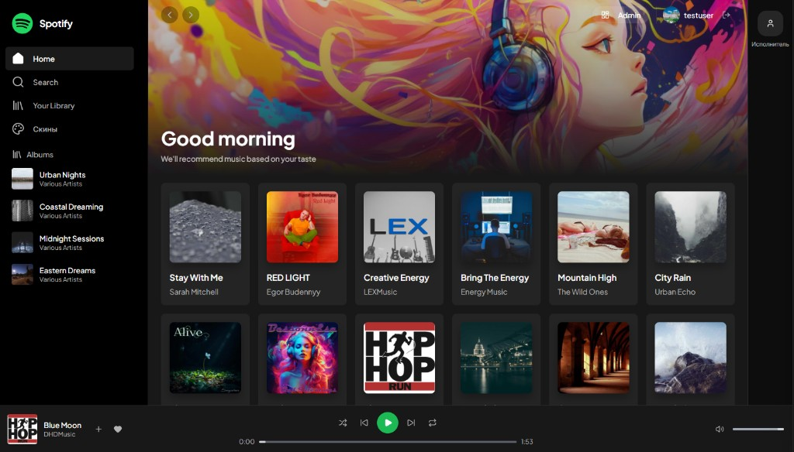
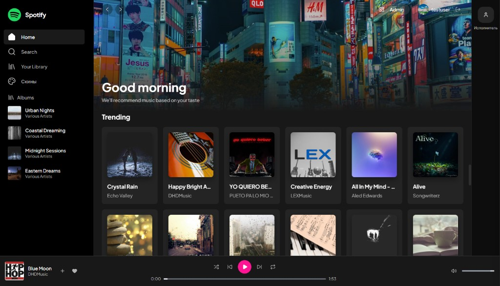
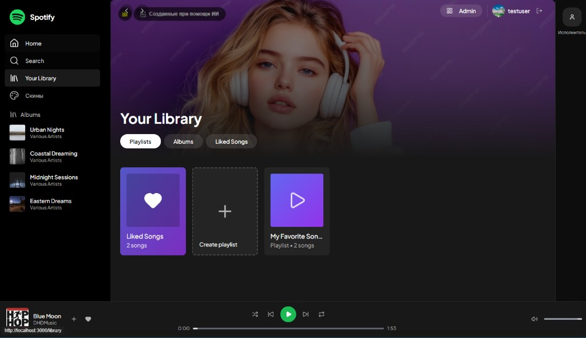
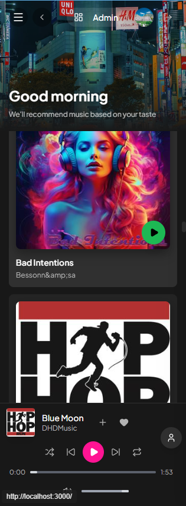
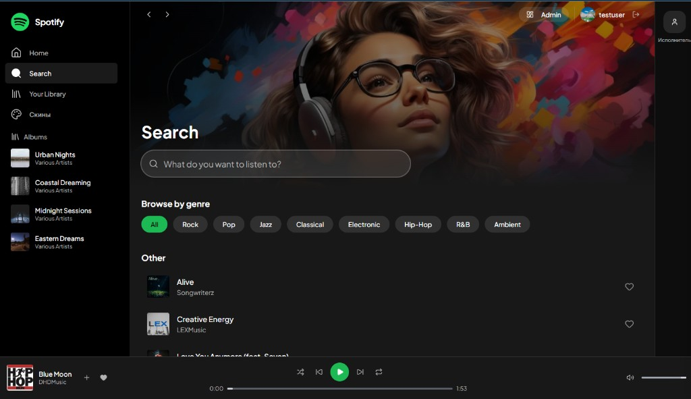
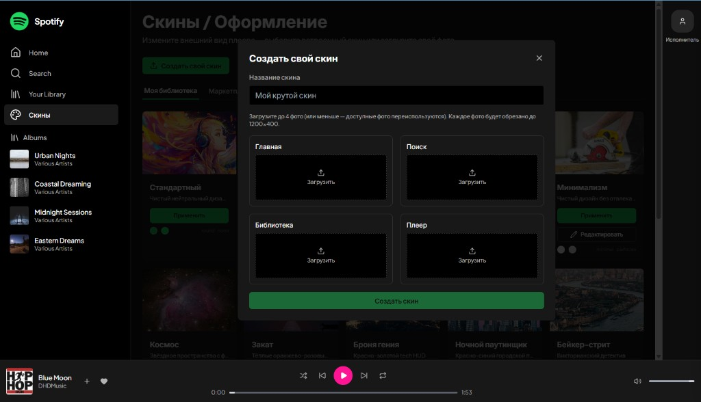
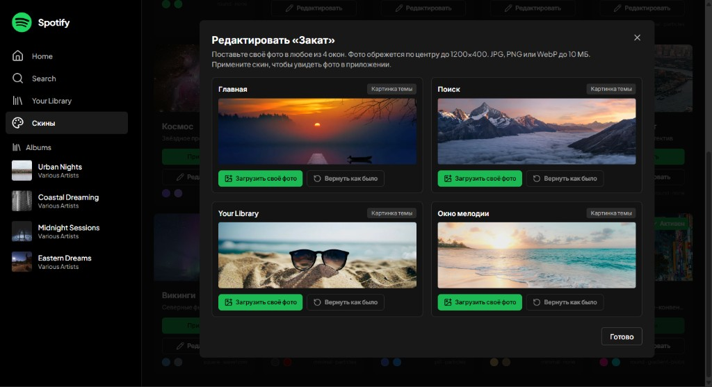

# Темы оформления LobStars

Тема (скин) меняет баннеры четырёх окон приложения: **Главная**, **Поиск**, **Your Library** и **окно выбранной мелодии/альбома**. Кроме баннеров тема задаёт акцентный цвет и форму кнопки «играть» в нижнем плеере. Тему выбирают на странице «Скины», ссылка на неё есть в меню слева. Применённая тема сразу видна на всех страницах.

Ниже 14 тематических скинов. Пятнадцатый, «Стандартный», показывает исходные заголовки приложения и не редактируется.

## Что на каждом скриншоте

Все скриншоты сняты на странице **Home** при ширине окна 1366 px, под тестовым пользователем. Показаны стандартные баннеры темы, своих фото нет. Расположение элементов одинаковое на всех скриншотах:

- **Слева** — меню: Home, Search, Your Library, «Скины» (значок палитры). Под ним — список альбомов.
- **Сверху** — баннер страницы с заголовком «Good morning». У каждой темы свой баннер для каждого из 4 окон; на скриншоте — баннер главной. В правом верхнем углу — кнопка «Admin» и профиль пользователя. У правого края — узкая панель с кнопкой «Исполнитель», которая открывает панель исполнителя поверх страницы.
- **Под баннером** — сетка карточек треков. Число колонок подстраивается под ширину окна (исправлено в PR #5). Проверено на ширинах 1024, 1280, 1366, 1600 и 1920 px на страницах Home, Search, Your Library, альбома и «Скины»: при закрытой и открытой панели исполнителя ни одна карточка не обрезается. Колонок получается 3, 5, 5, 6 и 8 соответственно.
- **Внизу** — плеер. Слева обложка и название трека. По центру кнопки: перемешать, назад, «играть», вперёд, повтор. Справа громкость. Кнопка «играть» окрашена в акцентный цвет темы, её форма зависит от стиля кнопок темы.

## Темы

### Классический Spotify

Баннер: концертный зал, толпа перед сценой в тёплом свете прожекторов. Кнопка «играть» — зелёный круг (#1DB954).

### Неоновая Ночь

Баннер: крупный розово-красный цветок на синем фоне. Кнопка «играть» — бирюзовый контур с бирюзовым значком (#00FFFF, стиль «контур»).

### Ретро Волны

Баннер: ретро-компьютер и игровая приставка в розово-фиолетовом свете. Кнопка «играть» — розовый круг (#FF6EC7, стиль «таблетка»: у квадратной кнопки выглядит как круг).

### Минимализм

Баннер: руки с циркулярной пилой в мастерской. Кнопка «играть» — белый значок без фона (#F5F5F5, стиль «минимальный»).

### Космос

Баннер: розово-фиолетовая туманность на звёздном небе. Кнопка «играть» — фиолетовый круг (#8B5CF6).

### Закат

Баннер: солнце садится за горизонт над водой, по краям силуэты деревьев. Кнопка «играть» — коралловый круг (#FF6B6B, стиль «таблетка»).

### Броня гения

Баннер: ночная Земля из космоса с огнями городов. Кнопка «играть» — красный квадрат (#C41E3A).

### Ночной паутинщик

Баннер: небоскрёбы большого города в сумерках. Кнопка «играть» — тёмно-красный контур (#8B0000, стиль «контур»), на тёмной панели плеера он малозаметен.

### Бейкер-стрит

Баннер: панорама города с изогнутой рекой, вид сверху. Кнопка «играть» — янтарный круг (#FFBF00).

### Викинги

Баннер: северное сияние над горами под звёздным небом. Кнопка «играть» — стально-синий квадрат (#4682B4).

### Железный трон

Баннер: каменная башня с воротами в тумане. Кнопка «играть» — почти чёрный значок без фона (#2C2C2C, стиль «минимальный»); на тёмной панели плеера его почти не видно.

### Звёздный флот

Баннер: Сатурн с кольцами на чёрном фоне. Кнопка «играть» — синий круг (#4169E1, стиль «таблетка»).

### Менталист

Баннер: руки с чашками кофе, на кофе рисунок латте-арт. Кнопка «играть» — бежево-золотой значок без фона (#D4A76A, стиль «минимальный»).

### Косплей

Баннер: ночная улица большого города с яркими вывесками. Кнопка «играть» — ярко-розовый круг (#FF1493).

## Как редактировать тему

На скриншоте — страница «Скины» с открытой панелью «Редактировать «Викинги»». Слева меню, пункт «Скины» выделен. Панель разделена на 4 окна: Главная, Поиск, Your Library, Окно мелодии. У каждого окна есть превью баннера, метка «Своё фото» или «Картинка темы» и кнопки «Загрузить своё фото» и «Вернуть как было». Внизу кнопка «Готово». За панелью видны карточки скинов с кнопками «Применить» и «Редактировать».

- **Где:** страница «Скины» → кнопка **«Редактировать»** на карточке темы. Кнопка есть у всех тем, кроме «Стандартного». Сервер тоже отклоняет правку «Стандартного» (ошибка 400).
- **4 окна:** Главная, Поиск, Your Library, Окно мелодии. На тему можно поставить не больше 4 фото, по одному на окно. Новое фото заменяет предыдущее в этом окне.
- **Файлы:** JPG, PNG или WebP, до 10 МБ. Фото автоматически обрезается по центру до 1200×400 и сохраняется в WebP. Пока фото загружается, на превью видна полоса и процент загрузки. Ошибки показываются по-русски, например «Подойдут только JPG, PNG или WebP», «Файл слишком большой (максимум 10 МБ)», «Файл не похож на изображение или повреждён».
- **«Вернуть как было»** работает для одного окна: убирает своё фото и возвращает стандартную картинку темы. Остальные окна не меняются.
- **Для кого:** фото сохраняются только для своего аккаунта. Стандартная тема и другие пользователи их не видят. Если тема активна, новое фото сразу появляется на всех страницах, перезагружать не нужно.
- **Гости:** вместо кнопки на карточке написано «Войдите, чтобы редактировать».

Пример: тема «Викинги» со своими фото. Сверху на главной вместо стандартного баннера — загруженное фото с надписью «Главная». Остальное — меню слева, сетка треков, синяя квадратная кнопка «играть» внизу — осталось от темы.

## Откуда стандартные баннеры

- **«Стандартный»** использует исходные заголовки приложения: `/home-header-bg.png`, `/search-header-bg.png`, `/library-header-bg.png`, `/album-header-bg.png`.
- **Все 14 тематических скинов** используют фотографии из `frontend/public/skins/<тема>/`. Источники и лицензии (Unsplash License, материалы NASA) перечислены в [frontend/public/skins/ATTRIBUTION.md](../frontend/public/skins/ATTRIBUTION.md).

## Скриншоты интерфейса

Скриншоты из папки `docs/screenshots/ui/`: разные окна приложения и окна работы со скинами.

**Главная (Home), скин «Стандартный».** Широкий экран. Сверху — стандартный баннер приложения (тот же файл, что у скина «Стандартный»): нарисованная девушка в наушниках с разноцветными развевающимися волосами, заголовок «Good morning». Слева — меню (Home, Search, Your Library, «Скины») и список альбомов; справа вверху — «Admin» и пользователь testuser, у правого края — кнопка «Исполнитель». Под баннером — сетка карточек треков по 6 в ряд, внизу — плеер с зелёной круглой кнопкой «играть».

**Главная (Home), тема «Косплей».** Баннер — стандартная картинка темы «Косплей»: ночная улица большого города с яркими вывесками и рекламными экранами (видна вывеска H&M). Под баннером — раздел «Trending» с карточками треков по 6 в ряд. Кнопка «играть» в нижнем плеере — ярко-розовый круг.

**Your Library, скин «Стандартный».** Баннер — стандартная картинка приложения: девушка в белых наушниках на фиолетовом фоне. На самой картинке есть плашка «Созданные при помощи ИИ» (левый верхний угол) и бледные водяные знаки. Под заголовком «Your Library» — вкладки Playlists, Albums, Liked Songs и карточки «Liked Songs» (2 songs), «Create playlist» и плейлист «My Favorite Son…» (Playlist • 2 songs). Кнопка «играть» в плеере — зелёный круг.

**Главная на узком (мобильном) экране, тема «Косплей».** Сверху — кнопка меню (☰), «Admin» и аватар, под ними баннер с ночной улицей и вывесками (видны UNIQLO и H&M) и заголовок «Good morning». Карточки треков идут в одну колонку на всю ширину (видны «Bad Intentions» и обложка «Hip Hop»), на карточке — зелёная кнопка «играть». Внизу — плеер в две строки: трек «Blue Moon», кнопки управления с ярко-розовой круглой кнопкой «играть» и полоса прогресса; справа над плеером — круглая кнопка «Исполнитель».

**Search, скин «Стандартный».** Баннер — стандартная картинка приложения: девушка в очках и наушниках на фоне цветных мазков. Под заголовком «Search» — поле «What do you want to listen to?». Ниже — «Browse by genre» с кнопками жанров (All, Rock, Pop, Jazz, Classical, Electronic, Hip-Hop, R&B, Ambient) и список треков «Other» с кнопками-сердечками. Кнопка «играть» в плеере — зелёный круг.

**Страница «Скины», окно «Создать свой скин».** Окно открывается кнопкой «Создать свой скин» над списком скинов. В нём — поле «Название скина» (в примере «Мой крутой скин»), подсказка «Загрузите до 4 фото (или меньше — доступные фото переиспользуются). Каждое фото будет обрезано до 1200×400», четыре места для фото — Главная, Поиск, Библиотека, Плеер — с кнопками «Загрузить» и зелёная кнопка «Создать скин». За окном видны вкладка «Моя библиотека» и карточки скинов: Стандартный, Минимализм (с кнопкой «Редактировать»), Космос, Закат, Броня гения, Ночной паутинщик, Бейкер-стрит.

**Страница «Скины», окно «Редактировать «Закат»».** Подсказка: «Поставьте своё фото в любое из 4 окон. Фото обрежется по центру до 1200×400. JPG, PNG или WebP до 10 МБ. Примените скин, чтобы увидеть фото в приложении.» Во всех четырёх окнах стоят стандартные картинки темы (метка «Картинка темы»): Главная — закат над озером с мостками и лодкой, Поиск — горные вершины над облаками, Your Library — солнечные очки на песке, Окно мелодии — морской берег на закате. У каждого окна — кнопки «Загрузить своё фото» и «Вернуть как было», внизу — «Готово».

